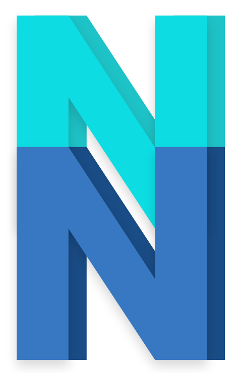

    <!-- Hero Section -->
    <section class="nv-hero" data-aos="fade-up">
        

            

                
                

                    
Developer • SecOps • Forensics Tinkerer

                    <h1 class="nv-title">
                        I build delightful docs &amp; tools, and break things (in labs) to learn.
                    </h1>
                    

                        Gudang contekan pribadi yang kebetulan online. Isinya catatan ngoprek CTF, lab investigasi, sampai jejak bug hasil buruan.
                    

                    

                        <a class="nv-btn nv-btn-primary" href="blog/">Blog</a>
                        <a class="nv-btn nv-btn-ghost" href="wretap/">Wretap</a>
                        <a class="nv-btn nv-btn-ghost" href="wiki/">Wiki</a>
                    

                

            

        

    </section>

    <!-- Marquee Tools -->
    

        

            Burp Suite • Splunk • Wireshark • Nmap • Metasploit • Python • Bash • Docker • Burp Suite • Splunk • Wireshark • Nmap
        

    

    <!-- Latest Posts Feed (Otomatis ditarik oleh niwPost.js) -->
    <section class="nv-section nv-wrap" data-aos="fade-up" style="margin-top: 3rem; margin-bottom: 5rem;">
        

            <h2 class="nv-sec-title">Aktivitas Terakhir</h2>
            <a class="nv-link" href="blog/">Semua pos →</a>
        

        <ul id="latest-posts-list" class="nv-latest">
            <li style="opacity: 0.5;">Loading contekan...</li>
        </ul>
    </section>

<!-- Script Inisialisasi & Fetcher -->

