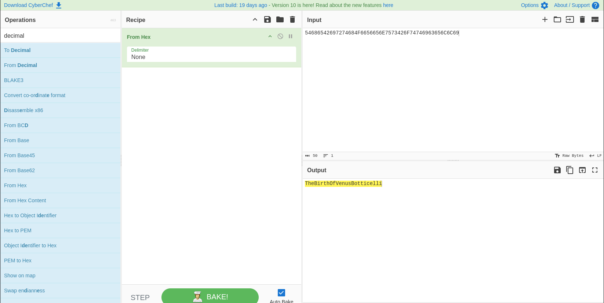

- #+BEGIN_EXAMPLE
  ┌─[y0tn@parrot]─[~/Hackviser/Labs/Cryptanalysis]
  └──╼ $cat > nums.txt << 'EOF'
  83 116 97 114 114 121 78 105 103 104 116 86 97 110 71 111 103 104
  EOF
  ┌─[y0tn@parrot]─[~/Hackviser/Labs/Cryptanalysis]
  └──╼ $awk '{for(i=1;i<=NF;i++) printf "%c",$i; print ""}' nums.txt
  StarryNightVanGogh
  #+END_EXAMPLE
  {:height 400, :width 780}
- #+BEGIN_EXAMPLE
  ┌─[y0tn@parrot]─[~/Hackviser/Labs/Cryptanalysis]
  └──╼ $echo -n 'TW9uYUxpc2FEYVZpbmNp' | base64 -d
  MonaLisaDaVinci
  #+END_EXAMPLE
  
- #+BEGIN_EXAMPLE
  ┌─[y0tn@parrot]─[~/Hackviser/Labs/Cryptanalysis]
  └──╼ $echo '%54%68%65%53%63%72%65%61%6D%4D%75%6E%63%68' | sed 's/%//g' | xxd -r -p
  TheScreamMunch
  #+END_EXAMPLE
  
- id:: 68abb264-12e2-4df8-a49c-3be621898d84
  #+BEGIN_EXAMPLE
  ┌─[y0tn@parrot]─[~/Hackviser/Labs/Cryptanalysis]
  └──╼ $echo '54686542697274684F6656656E7573426F74746963656C6C69' | xxd -r -p
  TheBirthOfVenusBotticelli
  #+END_EXAMPLE
  
- #+BEGIN_EXAMPLE
  ┌─[y0tn@parrot]─[~/Hackviser/Labs/Cryptanalysis]
  └──╼ $echo '01000111 01101001 01110010 01101100 01010111 01101001 01110100 01101000 01000001 01010000 01100101 01100001 01110010 01101100 01000101 01100001 01110010 01110010 01101001 01101110 01100111 01010110 01100101 01110010 01101101 01100101 01100101 01110010' \
  | awk 'function b2d(s, n,i){n=0; for(i=1;i<=length(s);i++) n = n*2 + substr(s,i,1); return n} {for(i=1;i<=NF;i++) printf "%02x", b2d($i)} END{print ""}' \
  | xxd -r -p
  GirlWithAPearlEarringVermeer
  #+END_EXAMPLE
  
- #+BEGIN_EXAMPLE
  ┌─[y0tn@parrot]─[~/Hackviser/Labs/Cryptanalysis]
  └──╼ $echo -n 'KRUGKUDFOJZWS43UMVXGGZKPMZGWK3LPOJ4UIYLMNE======' | base32 -d
  ThePersistenceOfMemoryDali
  #+END_EXAMPLE
  
- #+BEGIN_EXAMPLE
  ┌─[y0tn@parrot]─[~/Hackviser/Labs/Cryptanalysis]
  └──╼ $echo '=54=68=65=4E=69=67=68=74=57=61=74=63=68=52=65=6D=62=72=61=6E=64=74' \ | sed 's/=//g' | xxd -r -p
  TheNightWatchRembrandt
  #+END_EXAMPLE
  
- #+BEGIN_EXAMPLE
  ┌─[y0tn@parrot]─[~/Hackviser/Labs/Cryptanalysis]
  └──╼ $echo '&#70;&#105;&#115;&#104;&#101;&#114;&#109;&#101;&#110;&#65;&#116;&#83;&#101;&#97;&#84;&#117;&#114;&#110;&#101;&#114;' \ | grep -oE '[0-9]+' | awk '{printf "%c", $1} END{print ""}'
  FishermenAtSeaTurner
  #+END_EXAMPLE
  
- #+BEGIN_EXAMPLE
  ┌─[y0tn@parrot]─[~/Hackviser/Labs/Cryptanalysis]
  └──╼ $cat > msg.uue <<'EOF'
  begin 0744 odt_uuencoding_file.dat
  ,5&AE2VES<TML:6UT
  `
  end
  EOF
  ┌─[y0tn@parrot]─[~/Hackviser/Labs/Cryptanalysis]
  └──╼ $uudecode msg.uue
  ┌─[y0tn@parrot]─[~/Hackviser/Labs/Cryptanalysis]
  └──╼ $ls -la
  total 12
  drwxr-xr-x 1 y0tn y0tn 76 Agu 25 08:00 .
  drwxr-xr-x 1 y0tn y0tn 26 Agu 25 07:32 ..
  -rw-r--r-- 1 y0tn y0tn 59 Agu 25 07:59 msg.uue
  -rw-r--r-- 1 y0tn y0tn 66 Agu 25 07:33 nums.txt
  -rwxr--r-- 1 y0tn y0tn 12 Agu 25 08:00 odt_uuencoding_file.dat
  ┌─[y0tn@parrot]─[~/Hackviser/Labs/Cryptanalysis]
  └──╼ $cat odt_uuencoding_file.dat 
  TheKissKlimt
  #+END_EXAMPLE
- #+BEGIN_EXAMPLE
  ┌─[y0tn@parrot]─[~/Hackviser/Labs/Cryptanalysis]
  └──╼ $echo '8dbdda48fb8748d6746f1965824e966a' > hash.txt
  ┌─[y0tn@parrot]─[~/Hackviser/Labs/Cryptanalysis]
  └──╼ $john --format=raw-md5 --wordlist=/usr/share/wordlists/rockyou.txt hash.txt
  Using default input encoding: UTF-8
  Loaded 1 password hash (Raw-MD5 [MD5 256/256 AVX2 8x3])
  Warning: no OpenMP support for this hash type, consider --fork=16
  Press 'q' or Ctrl-C to abort, almost any other key for status
  simple           (?)     
  1g 0:00:00:00 DONE (2025-08-25 08:05) 100.0g/s 76800p/s 76800c/s 76800C/s jeffrey..james1
  Use the "--show --format=Raw-MD5" options to display all of the cracked passwords reliably
  Session completed. 
  ┌─[y0tn@parrot]─[~/Hackviser/Labs/Cryptanalysis]
  └──╼ $john --show --format=raw-md5 hash.txt
  ?:simple
  
  1 password hash cracked, 0 left
  
  #+END_EXAMPLE
  
- #+BEGIN_EXAMPLE
  ┌─[y0tn@parrot]─[~/Hackviser/Labs/Cryptanalysis]
  └──╼ $echo '7610bae85f2b530654cc716772f1fe653373e892' > hash.txt
  ┌─[y0tn@parrot]─[~/Hackviser/Labs/Cryptanalysis]
  └──╼ $john --format=raw-sha1 --wordlist=/usr/share/wordlists/rockyou.txt hash.txt
  Using default input encoding: UTF-8
  Loaded 1 password hash (Raw-SHA1 [SHA1 256/256 AVX2 8x])
  Warning: no OpenMP support for this hash type, consider --fork=16
  Press 'q' or Ctrl-C to abort, almost any other key for status
  leonardo         (?)     
  1g 0:00:00:00 DONE (2025-08-25 08:08) 100.0g/s 44000p/s 44000c/s 44000C/s 12345678910..amores
  Use the "--show --format=Raw-SHA1" options to display all of the cracked passwords reliably
  Session completed. 
  ┌─[y0tn@parrot]─[~/Hackviser/Labs/Cryptanalysis]
  └──╼ $john --show --format=raw-sha1 hash.txt
  ?:leonardo
  
  1 password hash cracked, 0 left
  
  #+END_EXAMPLE
  